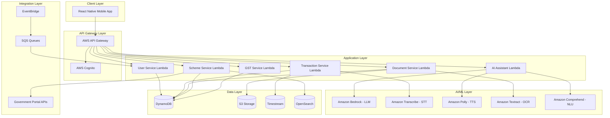

# Design Document: Arthamitra AI Finance Assistant

## Overview

Arthamitra is a serverless, mobile-first AI-powered financial management platform built on AWS infrastructure. The system uses a microservices architecture with event-driven patterns to handle voice processing, document OCR, financial tracking, GST compliance, and AI-powered scheme recommendations for Indian MSMEs.

The platform is designed for high scalability (1M concurrent users), low latency (API < 2s), and offline-first capabilities. All user data is encrypted end-to-end, with multi-language support for 8 regional Indian languages.

### Key Design Principles

1. **Voice-First Design**: All features accessible through voice interface for low-literacy users
2. **Offline-First**: Core features work without internet, sync when connected
3. **Security by Default**: E2E encryption, secure authentication, data isolation
4. **Serverless Architecture**: Auto-scaling, pay-per-use, minimal operational overhead
5. **AI-Powered Intelligence**: Contextual assistance, smart recommendations, natural language understanding

## Architecture

### High-Level Architecture



### Component Architecture

The system follows a serverless microservices pattern with the following components:

1. **Mobile Client**: React Native app with offline storage (AsyncStorage, SQLite)
2. **API Gateway**: REST API with request validation, throttling, and authentication
3. **Service Layer**: AWS Lambda functions for business logic
4. **AI/ML Services**: Managed AWS AI services for voice, vision, and language processing
5. **Data Layer**: Multi-model database approach (DynamoDB for transactional, Timestream for time-series, OpenSearch for search)
6. **Event Bus**: EventBridge for async communication between services

## Components and Interfaces

### 1. User Service

**Responsibility**: User registration, authentication, profile management, language preferences

**Key Functions**:
- `registerUser(phoneNumber, language)`: Create new user account
- `sendOTP(phoneNumber)`: Generate and send OTP via SMS
- `verifyOTP(phoneNumber, otp)`: Validate OTP and issue JWT token
- `updateProfile(userId, profileData)`: Update user business information
- `configureBiometric(userId, biometricData)`: Enable biometric authentication
- `getUserPreferences(userId)`: Retrieve language and notification settings

**Data Model**: User table in DynamoDB
**External Dependencies**: AWS Cognito for auth, SNS for OTP delivery

### 2. Voice Processor Service

**Responsibility**: Speech-to-text and text-to-speech conversion in regional languages

**Key Functions**:
- `transcribeAudio(audioBlob, language)`: Convert speech to text
- `synthesizeSpeech(text, language, voice)`: Convert text to speech
- `detectLanguage(audioBlob)`: Auto-detect spoken language
- `validateTranscription(text, context)`: Verify transcription accuracy using context

**Implementation**:
```typescript
interface VoiceProcessor {
  transcribeAudio(params: {
    audioBlob: Buffer,
    language: RegionalLanguage,
    sampleRate: number
  }): Promise<TranscriptionResult>
  
  synthesizeSpeech(params: {
    text: string,
    language: RegionalLanguage,
    voiceId: string,
    speed: number
  }): Promise<AudioBuffer>
}

interface TranscriptionResult {
  text: string,
  confidence: number,
  alternatives: string[],
  timestamp: number
}
```

**External Dependencies**: Amazon Transcribe, Amazon Polly
**Performance Target**: Transcription < 5s, Synthesis < 2s

### 3. Transaction Service

**Responsibility**: Record, categorize, and analyze financial transactions

**Key Functions**:
- `recordTransaction(userId, transactionData)`: Store income/expense record
- `parseVoiceTransaction(transcribedText)`: Extract amount, category, date from natural language
- `calculateProfitLoss(userId, startDate, endDate)`: Compute P&L for period
- `getCashFlowSummary(userId, period)`: Generate cash flow visualization data
- `categorizeTransaction(description, amount)`: Auto-categorize using ML
- `updateTransaction(transactionId, updates)`: Modify existing transaction
- `archiveTransaction(transactionId)`: Soft delete transaction

**Implementation**:
```typescript
interface TransactionService {
  recordTransaction(params: {
    userId: string,
    amount: number,
    type: 'income' | 'expense',
    category: string,
    description: string,
    date: Date,
    gstAmount?: number
  }): Promise<Transaction>
  
  parseVoiceTransaction(params: {
    text: string,
    userId: string
  }): Promise<ParsedTransaction>
  
  calculateProfitLoss(params: {
    userId: string,
    startDate: Date,
    endDate: Date
  }): Promise<ProfitLossReport>
}

interface ParsedTransaction {
  amount: number,
  type: 'income' | 'expense',
  category: string,
  description: string,
  date: Date,
  confidence: number,
  needsClarification: boolean,
  clarificationQuestions?: string[]
}
```

**Data Storage**: 
- DynamoDB for transaction records (fast lookup)
- Timestream for time-series analytics (efficient aggregation)

**Performance Target**: Record transaction < 500ms, Calculate P&L < 1s

### 4. Document Service

**Responsibility**: Capture, process, store, and retrieve business documents with OCR

**Key Functions**:
- `captureDocument(userId, imageData)`: Store document image
- `processOCR(documentId)`: Extract text and metadata from document
- `classifyDocument(extractedText)`: Determine document type
- `searchDocuments(userId, query)`: Full-text search across documents
- `generateShareLink(documentId, expiryHours)`: Create secure shareable link
- `categorizeDocument(documentId, category)`: Apply user-defined category

**Implementation**:
```typescript
interface DocumentService {
  captureDocument(params: {
    userId: string,
    imageData: Buffer,
    metadata: DocumentMetadata
  }): Promise<Document>
  
  processOCR(params: {
    documentId: string
  }): Promise<OCRResult>
  
  searchDocuments(params: {
    userId: string,
    query: string,
    filters?: DocumentFilters
  }): Promise<Document[]>
}

interface OCRResult {
  documentId: string,
  extractedText: string,
  confidence: number,
  detectedFields: {
    amount?: number,
    date?: Date,
    invoiceNumber?: string,
    gstNumber?: string,
    partyName?: string
  },
  documentType: DocumentType,
  requiresReview: boolean
}

type DocumentType = 'invoice' | 'license' | 'certificate' | 'tax_document' | 'bank_statement' | 'other'
```

**Data Storage**:
- S3 for document images (encrypted at rest)
- DynamoDB for metadata and extracted text
- OpenSearch for full-text search

**Performance Target**: OCR processing < 10s, Search < 1s

### 5. Scheme Recommender Service

**Responsibility**: Match users to eligible government schemes, provide recommendations

**Key Functions**:
- `getRecommendations(userId)`: Return ranked list of eligible schemes
- `analyzeEligibility(userId, schemeId)`: Check if user qualifies for specific scheme
- `searchSchemes(query, filters)`: Search 200+ government schemes
- `getSchemeDetails(schemeId)`: Retrieve full scheme information
- `trackApplication(userId, schemeId, status)`: Monitor application progress
- `syncGovernmentSchemes()`: Periodic update from government APIs

**Implementation**:
```typescript
interface SchemeRecommender {
  getRecommendations(params: {
    userId: string,
    limit: number
  }): Promise<SchemeRecommendation[]>
  
  analyzeEligibility(params: {
    userId: string,
    schemeId: string
  }): Promise<EligibilityResult>
}

interface SchemeRecommendation {
  schemeId: string,
  name: string,
  description: string,
  benefitAmount: number,
  eligibilityScore: number,
  matchReasons: string[],
  deadline: Date,
  requiredDocuments: string[],
  applicationUrl: string
}

interface EligibilityResult {
  eligible: boolean,
  score: number,
  matchedCriteria: string[],
  missingCriteria: string[],
  requiredActions: string[]
}
```

**Eligibility Matching Algorithm**:
1. Extract user profile features (business type, turnover, location, sector)
2. Load scheme eligibility criteria from database
3. Calculate match score using weighted criteria
4. Rank schemes by score and deadline proximity
5. Filter out schemes user already applied to

**Data Storage**:
- DynamoDB for scheme data and user applications
- OpenSearch for scheme search with filters

**Performance Target**: Recommendations < 2s, Search < 1s

### 6. GST Compliance Service

**Responsibility**: GST calculations, reminders, report generation

**Key Functions**:
- `registerGSTIN(userId, gstin)`: Validate and store GST number
- `calculateGSTLiability(userId, period)`: Compute tax payable
- `generateGSTReport(userId, period, format)`: Create GSTN-compatible report
- `scheduleReminders(userId)`: Set up filing deadline notifications
- `extractGSTFromTransaction(transaction)`: Parse GST component from amount
- `calculateLateFee(filingDate, dueDate)`: Compute penalty for late filing

**Implementation**:
```typescript
interface GSTService {
  calculateGSTLiability(params: {
    userId: string,
    startDate: Date,
    endDate: Date
  }): Promise<GSTCalculation>
  
  generateGSTReport(params: {
    userId: string,
    period: string,
    format: 'json' | 'pdf'
  }): Promise<GSTReport>
}

interface GSTCalculation {
  outputTax: number,
  inputTaxCredit: number,
  netPayable: number,
  transactions: {
    sales: Transaction[],
    purchases: Transaction[]
  },
  gstRate: number
}
```

**GST Calculation Logic**:
1. Filter transactions by date range
2. Separate sales (output tax) and purchases (input tax credit)
3. Apply GST rates based on transaction category
4. Calculate net payable = output tax - input tax credit
5. Add late fee if applicable

**Data Storage**: DynamoDB for GST records and filing history

**Performance Target**: Calculation < 1s, Report generation < 3s

### 7. AI Assistant Service

**Responsibility**: Conversational AI for answering queries, providing guidance

**Key Functions**:
- `processQuery(userId, message, conversationId)`: Handle user question
- `generateResponse(query, context)`: Create contextual answer using LLM
- `extractIntent(message)`: Determine user's goal
- `retrieveContext(userId)`: Fetch relevant user data for personalization
- `escalateToHuman(conversationId)`: Transfer to support agent

**Implementation**:
```typescript
interface AIAssistant {
  processQuery(params: {
    userId: string,
    message: string,
    conversationId: string,
    language: RegionalLanguage
  }): Promise<AIResponse>
  
  generateResponse(params: {
    query: string,
    context: UserContext,
    conversationHistory: Message[]
  }): Promise<string>
}

interface AIResponse {
  message: string,
  intent: string,
  confidence: number,
  suggestedActions: Action[],
  requiresHumanEscalation: boolean
}

interface UserContext {
  userId: string,
  businessType: string,
  recentTransactions: Transaction[],
  eligibleSchemes: Scheme[],
  gstStatus: GSTStatus,
  language: RegionalLanguage
}
```

**AI Pipeline**:
1. Receive user message in regional language
2. Translate to English if needed (using Comprehend)
3. Extract intent and entities
4. Retrieve user context (transactions, schemes, documents)
5. Generate response using Amazon Bedrock (Claude/Llama)
6. Translate response back to user's language
7. Convert to speech if voice mode active

**External Dependencies**: Amazon Bedrock, Amazon Comprehend, Amazon Translate

**Performance Target**: Response < 2s

## Data Models

### User Profile

```typescript
interface User {
  userId: string,              // Primary key (UUID)
  phoneNumber: string,         // Unique, indexed
  language: RegionalLanguage,
  createdAt: Date,
  lastLoginAt: Date,
  
  // Business Information
  businessName: string,
  businessType: string,        // Retail, Manufacturing, Services, etc.
  sector: string,              // Textiles, Food, IT, etc.
  annualTurnover: number,
  employeeCount: number,
  location: {
    state: string,
    district: string,
    pincode: string
  },
  
  // Compliance
  gstin?: string,              // GST Identification Number
  panNumber?: string,
  udyamNumber?: string,        // MSME registration number
  
  // Preferences
  notificationSettings: {
    gstReminders: boolean,
    schemeAlerts: boolean,
    dailySummary: boolean
  },
  biometricEnabled: boolean,
  
  // Encryption
  encryptionKeyId: string      // KMS key for E2E encryption
}
```

**Storage**: DynamoDB table `Users`
**Indexes**: 
- GSI on `phoneNumber` for login lookup
- GSI on `location.state` for regional scheme matching

### Transaction

```typescript
interface Transaction {
  transactionId: string,       // Primary key (UUID)
  userId: string,              // Partition key for user queries
  timestamp: Date,             // Sort key for time-based queries
  
  // Transaction Details
  amount: number,
  type: 'income' | 'expense',
  category: string,            // Sales, Purchase, Salary, Rent, etc.
  description: string,
  paymentMode: string,         // Cash, UPI, Bank Transfer, etc.
  
  // GST Information
  gstAmount?: number,
  gstRate?: number,
  gstType?: 'CGST' | 'SGST' | 'IGST',
  
  // Metadata
  source: 'voice' | 'manual' | 'imported',
  voiceTranscript?: string,
  confidence?: number,
  
  // Audit
  createdAt: Date,
  updatedAt: Date,
  isArchived: boolean
}
```

**Storage**: 
- DynamoDB table `Transactions` for operational queries
- Timestream table `TransactionTimeSeries` for analytics

**Indexes**:
- GSI on `userId` + `timestamp` for user transaction history
- GSI on `userId` + `category` for category-wise analysis

### Document

```typescript
interface Document {
  documentId: string,          // Primary key (UUID)
  userId: string,              // Partition key
  uploadedAt: Date,            // Sort key
  
  // Storage
  s3Key: string,               // S3 object key for image
  s3Bucket: string,
  fileSize: number,
  mimeType: string,
  
  // OCR Results
  extractedText: string,
  ocrConfidence: number,
  detectedFields: {
    amount?: number,
    date?: Date,
    invoiceNumber?: string,
    gstNumber?: string,
    partyName?: string
  },
  
  // Classification
  documentType: DocumentType,
  category?: string,           // User-defined category
  tags: string[],
  
  // Sharing
  shareLinks: {
    linkId: string,
    expiresAt: Date,
    accessCount: number
  }[],
  
  // Metadata
  isProcessed: boolean,
  requiresReview: boolean
}
```

**Storage**:
- S3 bucket `arthamitra-documents` for images (encrypted)
- DynamoDB table `Documents` for metadata
- OpenSearch index `documents` for full-text search

### Scheme

```typescript
interface Scheme {
  schemeId: string,            // Primary key
  name: string,
  nameTranslations: {          // Scheme name in all languages
    [key in RegionalLanguage]: string
  },
  
  // Details
  description: string,
  descriptionTranslations: {
    [key in RegionalLanguage]: string
  },
  benefitType: string,         // Loan, Subsidy, Grant, etc.
  benefitAmount: {
    min: number,
    max: number
  },
  
  // Eligibility Criteria
  eligibility: {
    businessTypes: string[],
    sectors: string[],
    states: string[],
    minTurnover?: number,
    maxTurnover?: number,
    minEmployees?: number,
    maxEmployees?: number,
    requiredDocuments: string[]
  },
  
  // Application
  applicationUrl: string,
  applicationDeadline?: Date,
  processingTime: string,
  
  // Metadata
  governmentDepartment: string,
  lastUpdated: Date,
  isActive: boolean
}
```

**Storage**:
- DynamoDB table `Schemes`
- OpenSearch index `schemes` for search and filtering

**Indexes**:
- GSI on `isActive` + `applicationDeadline` for active schemes
- GSI on `eligibility.states` for regional filtering

### Conversation

```typescript
interface Conversation {
  conversationId: string,      // Primary key (UUID)
  userId: string,              // Partition key
  startedAt: Date,
  lastMessageAt: Date,
  
  // Messages
  messages: Message[],
  
  // Context
  intent: string,
  resolvedTopics: string[],
  pendingActions: string[],
  
  // Status
  status: 'active' | 'resolved' | 'escalated',
  escalatedToHuman: boolean,
  satisfactionRating?: number
}

interface Message {
  messageId: string,
  role: 'user' | 'assistant',
  content: string,
  timestamp: Date,
  language: RegionalLanguage,
  audioUrl?: string            // S3 URL if voice message
}
```

**Storage**: DynamoDB table `Conversations`

## Correctness Properties

*A property is a characteristic or behavior that should hold true across all valid executions of a system—essentially, a formal statement about what the system should do. Properties serve as the bridge between human-readable specifications and machine-verifiable correctness guarantees.*


### Property Reflection

After analyzing all acceptance criteria, I've identified several areas where properties can be consolidated:

1. **Language Persistence**: Properties 1.2, 2.4, 11.1, 11.4, 11.8, 12.3 all test language handling - can be consolidated into comprehensive language consistency property
2. **Data Encryption**: Properties 1.7, 4.5, 9.1 all test encryption - can be combined into single encryption property
3. **Notification Scheduling**: Properties 6.2, 12.1, 12.2 all test notification timing - can be consolidated
4. **Transaction Operations**: Properties 5.3, 5.8, 5.9 all test transaction CRUD - can be combined into transaction integrity property
5. **GST Calculations**: Properties 6.3, 6.4, 6.6 all test GST computation - can be consolidated into comprehensive GST calculation property
6. **Search Functionality**: Properties 4.6, 3.2 test search/filtering - can be combined into general search property
7. **Form Pre-filling**: Properties 3.5, 3.6 test form handling - can be consolidated
8. **AI Context**: Properties 7.3, 7.4, 7.6, 7.8 all test AI contextualization - can be combined

After reflection, I've reduced 80+ testable criteria to 35 unique, non-redundant properties.

### Correctness Properties

#### Authentication and User Management Properties

**Property 1: Language Preference Persistence**
*For any* user and any Regional_Language selection, when the user sets their language preference, all subsequent UI text, voice output, notifications, and error messages should be displayed in that language until changed.
**Validates: Requirements 1.2, 2.4, 11.1, 11.4, 11.8, 12.3**

**Property 2: OTP Validation with Retry Limits**
*For any* user authentication attempt, when invalid OTPs are entered, the system should allow exactly 3 retry attempts before locking the account, and valid OTPs should always proceed to profile creation.
**Validates: Requirements 1.5, 1.6**

**Property 3: Authentication Enforcement**
*For any* user attempting to access the platform, authentication via OTP or Biometric_Auth must be successfully completed before accessing any protected features.
**Validates: Requirements 1.9, 9.3**

**Property 4: Account Lockout After Failed Attempts**
*For any* user account, when authentication fails 5 consecutive times, the account should be temporarily locked and the user should receive a notification.
**Validates: Requirements 9.4**

#### Voice Processing Properties

**Property 5: Voice Transcription Accuracy**
*For any* audio input in any Regional_Language, the Voice_Processor should transcribe the speech to text and display it for user confirmation with a confidence score.
**Validates: Requirements 2.2, 2.3**

**Property 6: Offline Voice Queueing**
*For any* voice input recorded while offline, the system should queue the input locally and process it when network connection is restored, maintaining the original timestamp.
**Validates: Requirements 2.6, 10.1**

**Property 7: Voice Transcription Fallback**
*For any* voice transcription that fails (confidence below threshold or error), the system should provide a text input fallback option to the user.
**Validates: Requirements 2.7**

#### Scheme Recommendation Properties

**Property 8: Scheme Eligibility Matching**
*For any* user profile, the Scheme_Recommender should return only schemes where the user meets all mandatory eligibility criteria, ranked by match score and deadline proximity.
**Validates: Requirements 3.2**

**Property 9: Scheme Display Completeness**
*For any* scheme displayed to the user, the UI should include scheme name, eligibility criteria, benefit amount, and application deadline.
**Validates: Requirements 3.3**

**Property 10: Application Form Pre-filling**
*For any* scheme application initiated by a user, the form should be pre-filled with all available user profile data, and missing required fields should be highlighted with guidance.
**Validates: Requirements 3.5, 3.6**

**Property 11: Application Tracking**
*For any* submitted scheme application, the system should create a stored record with a unique tracking reference that the user can retrieve.
**Validates: Requirements 3.7**

#### Document Management Properties

**Property 12: OCR Field Extraction**
*For any* document image processed by the OCR_Engine, the system should extract text content and attempt to identify structured fields (amount, date, invoice number, GST number, party name) with confidence scores.
**Validates: Requirements 4.2, 4.3**

**Property 13: Document Storage with Encryption**
*For any* document confirmed by the user, the system should store the original image in S3 with encryption, store metadata in DynamoDB, and index extracted text in OpenSearch.
**Validates: Requirements 4.5, 9.1**

**Property 14: Document Search Accuracy**
*For any* search query, the system should return all documents where the query matches text content, falls within date range, or matches document type/category.
**Validates: Requirements 4.6**

**Property 15: Document Categorization**
*For any* document, when a user applies a category tag (invoice, license, certificate, tax document, bank statement), the system should persist the category and use it for filtering.
**Validates: Requirements 4.7**

**Property 16: Poor Quality Document Handling**
*For any* document image where OCR confidence is below 70%, the system should request the user to recapture with specific guidance on improving quality.
**Validates: Requirements 4.8**

**Property 17: Secure Document Sharing**
*For any* document share request, the system should generate a unique shareable link with a specified expiration time, and the link should become invalid after expiration.
**Validates: Requirements 4.10**

#### Transaction Tracking Properties

**Property 18: Voice Transaction Parsing**
*For any* voice input describing a transaction, the system should extract amount, category, date, and description, and display the parsed transaction for user confirmation before storing.
**Validates: Requirements 5.1, 5.2**

**Property 19: Transaction Storage Integrity**
*For any* confirmed transaction, the system should store it with timestamp, user ID, and all transaction details, and the transaction should be retrievable by transaction ID.
**Validates: Requirements 5.3**

**Property 20: Profit/Loss Calculation Accuracy**
*For any* time period (daily, weekly, monthly), the system should calculate profit/loss as (sum of income transactions) - (sum of expense transactions) for that period.
**Validates: Requirements 5.4, 5.5**

**Property 21: Cash Flow Report Generation**
*For any* date range, the system should generate a cash flow report showing income vs expenses over time with accurate totals.
**Validates: Requirements 5.6**

**Property 22: Transaction Update Propagation**
*For any* transaction edit or deletion, the system should update the transaction record (or archive if deleted) and recalculate all affected financial summaries (daily, weekly, monthly P&L).
**Validates: Requirements 5.8, 5.9**

**Property 23: Ambiguous Transaction Clarification**
*For any* voice transaction input where extracted fields have low confidence or missing required data, the AI_Assistant should ask clarifying questions before storing.
**Validates: Requirements 5.7**

#### GST Compliance Properties

**Property 24: GSTIN Format Validation**
*For any* GST number input, the system should validate the format (15 characters, specific pattern) before storing it encrypted.
**Validates: Requirements 6.1**

**Property 25: GST Filing Reminders**
*For any* registered GSTIN with an upcoming filing deadline, the system should schedule and send reminder notifications at 7 days, 3 days, and 1 day before the deadline.
**Validates: Requirements 6.2, 12.1**

**Property 26: GST Liability Calculation**
*For any* time period, the system should calculate GST liability as (output tax from sales) - (input tax credit from purchases), showing input tax credit, output tax, and net payable amount.
**Validates: Requirements 6.3, 6.4, 6.6**

**Property 27: GST Report Format Compliance**
*For any* GST report generation request, the system should create a formatted report (JSON or PDF) that matches GSTN requirements with all required fields.
**Validates: Requirements 6.5**

**Property 28: GST Rate Updates**
*For any* GST rate change, the system should apply the new rate to all future transactions and notify the user of the change.
**Validates: Requirements 6.7**

**Property 29: Late Filing Penalty Calculation**
*For any* GST filing that occurs after the deadline, the system should calculate the late fee based on the number of days delayed and display the penalty amount.
**Validates: Requirements 6.8**

**Property 30: GST Filing Status Tracking**
*For any* GST return filing, the system should store the filing confirmation and update the user's compliance status to "filed" for that period.
**Validates: Requirements 6.9**

#### AI Assistant Properties

**Property 31: AI Contextual Responses**
*For any* user query to the AI_Assistant, the response should reference the user's specific business data (recent transactions, eligible schemes, GST status) when relevant to the query.
**Validates: Requirements 7.2, 7.3, 7.4, 7.6**

**Property 32: AI Escalation Logic**
*For any* query where the AI_Assistant confidence is below threshold or cannot provide an answer, the system should escalate to human support and notify the user of expected response time.
**Validates: Requirements 7.7**

**Property 33: Conversation Context Maintenance**
*For any* conversation with multiple messages, the AI_Assistant should maintain context from previous messages in the conversation when generating responses.
**Validates: Requirements 7.8**

**Property 34: AI Feedback Storage**
*For any* user feedback (positive or negative) on an AI response, the system should store the feedback with the message ID and conversation ID for model improvement.
**Validates: Requirements 7.9**

#### Security Properties

**Property 35: Data Encryption at Rest**
*For any* user data stored in the system (profile, transactions, documents, conversations), the data should be encrypted using E2E_Encryption before being written to storage.
**Validates: Requirements 1.7, 4.5, 9.1**

**Property 36: Audit Logging for Sensitive Access**
*For any* access to sensitive user data (financial records, documents, GST information), the system should create an audit log entry with timestamp, user ID, and accessed resource.
**Validates: Requirements 9.5**

**Property 37: Password Hashing**
*For any* password or secret stored in the system, it should be hashed using industry-standard algorithms (bcrypt, Argon2) before storage, never stored in plaintext.
**Validates: Requirements 9.6**

**Property 38: Data Deletion Compliance**
*For any* user data deletion request, the system should permanently remove all personal data from active storage and mark backups for deletion.
**Validates: Requirements 9.7**

**Property 39: Input Validation and Sanitization**
*For any* API request with user input, the system should validate data types, sanitize strings to prevent injection attacks, and reject malformed requests.
**Validates: Requirements 9.9**

#### Offline and Sync Properties

**Property 40: Offline Document Capture Queueing**
*For any* document captured while offline, the system should store the image locally and queue it for OCR processing when network connection is restored.
**Validates: Requirements 10.2**

**Property 41: Offline Data Display**
*For any* request to view financial summaries or reports while offline, the system should display cached data with a clear indicator that data may not be current.
**Validates: Requirements 10.3**

**Property 42: Sync Conflict Resolution**
*For any* data conflict detected during sync (same record modified on multiple devices), the system should apply last-write-wins strategy and notify the user of the conflict.
**Validates: Requirements 10.5**

**Property 43: Offline Storage Limit Enforcement**
*For any* offline storage that exceeds 100MB, the system should prompt the user to sync and clear cache before allowing additional offline operations.
**Validates: Requirements 10.6**

#### Localization and Accessibility Properties

**Property 44: Regional Font Support**
*For any* text displayed in a Regional_Language, the system should use fonts that support all characters in that language's script (Devanagari, Tamil, Telugu, etc.).
**Validates: Requirements 11.1**

**Property 45: Touch Target Sizing**
*For any* interactive UI element (button, link, input field), the touch target should be at least 44x44 pixels to ensure accessibility.
**Validates: Requirements 11.2**

**Property 46: Indian Number Formatting**
*For any* financial amount displayed, the system should format numbers according to the Indian numbering system (using lakhs and crores) with appropriate separators.
**Validates: Requirements 11.3**

**Property 47: Localized Date Formatting**
*For any* date displayed, the system should use the date format convention appropriate for the user's selected Regional_Language.
**Validates: Requirements 11.4**

**Property 48: Responsive Font Scaling**
*For any* font size adjustment by the user, all text should scale proportionally without breaking the layout or causing text overflow.
**Validates: Requirements 11.6**

#### Notification Properties

**Property 49: Scheme Deadline Notifications**
*For any* scheme with an application deadline where the user is eligible, the system should send a notification 5 days before the closing date.
**Validates: Requirements 12.2**

**Property 50: Notification Navigation**
*For any* notification tapped by the user, the system should navigate to the relevant screen with appropriate context (e.g., scheme details, GST filing page).
**Validates: Requirements 12.4**

**Property 51: Notification Preference Enforcement**
*For any* notification category disabled by the user, the system should not send notifications of that type, except for critical security alerts which override preferences.
**Validates: Requirements 12.5, 12.6**

**Property 52: Notification Grouping**
*For any* set of related notifications pending delivery, the system should group them into a single notification to avoid overwhelming the user.
**Validates: Requirements 12.7**

**Property 53: Inactivity Engagement Reminders**
*For any* user who has not opened the app for 7 consecutive days, the system should send an engagement reminder with personalized content based on their business data.
**Validates: Requirements 12.8**

#### Analytics Properties

**Property 54: Dashboard Metrics Display**
*For any* dashboard view request, the system should display key metrics including revenue, expenses, profit margin, and cash flow calculated from the default 30-day period.
**Validates: Requirements 13.1, 13.2**

**Property 55: Date Range Metric Recalculation**
*For any* custom date range selected by the user, the system should recalculate and display all metrics (revenue, expenses, profit margin) for that specific period.
**Validates: Requirements 13.3**

**Property 56: Trend Comparison Visualization**
*For any* trend chart displayed, the system should show data comparing the current period to the previous period of equal length.
**Validates: Requirements 13.4**

**Property 57: Profit Margin Alert Threshold**
*For any* calculation where profit margin decreases by 10% or more compared to the previous period, the system should alert the user with suggested actions.
**Validates: Requirements 13.5**

**Property 58: Expense Breakdown Categorization**
*For any* expense breakdown request, the system should categorize all expenses by category and display each category with its percentage of total expenses.
**Validates: Requirements 13.6**

**Property 59: Financial Report Export**
*For any* report export request, the system should generate a PDF or Excel file containing all financial data for the selected period with proper formatting.
**Validates: Requirements 13.8**

#### Backup and Recovery Properties

**Property 60: Backup Integrity Verification**
*For any* completed backup operation, the system should calculate and store checksums for all backed-up data to enable integrity verification during restore.
**Validates: Requirements 14.2**

**Property 61: Data Restore Functionality**
*For any* data restore request, the system should retrieve the latest backup and restore all user data to the state at the time of backup.
**Validates: Requirements 14.3**

**Property 62: Multi-Device Data Sync**
*For any* user logged in on multiple devices, when data is modified on one device, the changes should sync to all other devices.
**Validates: Requirements 14.4**

**Property 63: Backup Retry Logic**
*For any* failed backup operation, the system should retry up to 3 times with exponential backoff, and notify the user only if all attempts fail.
**Validates: Requirements 14.5**

**Property 64: Account Deletion Backup Retention**
*For any* user account deletion request, the system should retain backups for 90 days before permanent deletion to allow recovery if needed.
**Validates: Requirements 14.6**

#### External Integration Properties

**Property 65: Government Scheme API Integration**
*For any* scheme search request, the system should fetch data from government portal APIs, parse the response, and display the schemes list with all available details.
**Validates: Requirements 15.1, 15.2**

## Error Handling

### Error Categories

1. **User Input Errors**: Invalid data, missing required fields, format violations
2. **Authentication Errors**: Invalid OTP, expired tokens, account locked
3. **Network Errors**: Connection timeout, API unavailable, rate limiting
4. **Processing Errors**: OCR failure, voice transcription failure, AI service errors
5. **Data Errors**: Sync conflicts, data corruption, storage limits exceeded
6. **External Service Errors**: Government API failures, AWS service outages

### Error Handling Strategy

**Graceful Degradation**:
- When voice transcription fails, offer text input fallback
- When OCR fails, allow manual data entry
- When AI Assistant is unavailable, provide FAQ and support contact
- When network is unavailable, enable offline mode with sync on reconnection

**User-Friendly Error Messages**:
- Display errors in user's Regional_Language
- Provide clear explanation of what went wrong
- Offer specific resolution steps
- Include support contact for unresolvable errors

**Retry Logic**:
- Automatic retry with exponential backoff for transient failures
- Maximum 3 retry attempts for API calls
- User-initiated retry option for failed operations
- Queue operations for later retry when offline

**Error Logging and Monitoring**:
- Log all errors with context (user ID, operation, timestamp)
- Track error rates and patterns for proactive fixes
- Alert on critical errors (security, data loss, service outages)
- Maintain error logs for debugging and compliance

### Specific Error Scenarios

**Voice Processing Errors**:
```typescript
if (transcriptionConfidence < 0.7) {
  // Low confidence - ask user to repeat or offer text input
  return {
    success: false,
    error: 'TRANSCRIPTION_LOW_CONFIDENCE',
    message: 'Could not understand clearly. Please try again or type your message.',
    fallbackOption: 'text_input'
  }
}
```

**OCR Processing Errors**:
```typescript
if (ocrConfidence < 0.7 || imageQuality === 'poor') {
  // Poor quality - request recapture with guidance
  return {
    success: false,
    error: 'OCR_POOR_QUALITY',
    message: 'Document image is not clear. Please ensure good lighting and focus.',
    guidance: ['Place document on flat surface', 'Ensure good lighting', 'Avoid shadows and glare'],
    allowManualEntry: true
  }
}
```

**Network Errors**:
```typescript
if (networkError) {
  // Enable offline mode and queue operations
  enableOfflineMode()
  queueOperation(operation)
  return {
    success: false,
    error: 'NETWORK_UNAVAILABLE',
    message: 'No internet connection. Your data will be saved and synced when connection is restored.',
    offlineMode: true
  }
}
```

**Authentication Errors**:
```typescript
if (failedAttempts >= 5) {
  // Lock account and notify user
  lockAccount(userId, duration: '30 minutes')
  sendNotification(userId, 'ACCOUNT_LOCKED')
  return {
    success: false,
    error: 'ACCOUNT_LOCKED',
    message: 'Too many failed attempts. Your account is temporarily locked for 30 minutes.',
    unlockTime: Date.now() + 30 * 60 * 1000
  }
}
```

## Testing Strategy

### Dual Testing Approach

The Arthamitra platform requires both unit testing and property-based testing for comprehensive coverage:

**Unit Tests**: Verify specific examples, edge cases, and error conditions
- Specific user flows (onboarding, transaction recording)
- Edge cases (empty inputs, boundary values, special characters)
- Error conditions (network failures, invalid data, service outages)
- Integration points between components
- UI component rendering and interactions

**Property Tests**: Verify universal properties across all inputs
- Data integrity properties (encryption, storage, retrieval)
- Calculation accuracy (P&L, GST, metrics)
- Language consistency across all features
- Security properties (authentication, authorization, audit logging)
- Sync and conflict resolution logic

Both testing approaches are complementary and necessary. Unit tests catch concrete bugs in specific scenarios, while property tests verify general correctness across the input space.

### Property-Based Testing Configuration

**Testing Library**: Use `fast-check` for TypeScript/JavaScript property-based testing

**Test Configuration**:
- Minimum 100 iterations per property test (due to randomization)
- Each property test must reference its design document property
- Tag format: `// Feature: arthamitra-ai-finance-assistant, Property {number}: {property_text}`

**Example Property Test**:
```typescript
import fc from 'fast-check'

// Feature: arthamitra-ai-finance-assistant, Property 20: Profit/Loss Calculation Accuracy
describe('Profit/Loss Calculation', () => {
  it('should calculate P&L as income minus expenses for any transaction set', () => {
    fc.assert(
      fc.property(
        fc.array(transactionArbitrary()),
        (transactions) => {
          const income = transactions
            .filter(t => t.type === 'income')
            .reduce((sum, t) => sum + t.amount, 0)
          
          const expenses = transactions
            .filter(t => t.type === 'expense')
            .reduce((sum, t) => sum + t.amount, 0)
          
          const calculatedPL = calculateProfitLoss(transactions)
          
          expect(calculatedPL).toBeCloseTo(income - expenses, 2)
        }
      ),
      { numRuns: 100 }
    )
  })
})
```

### Test Coverage Requirements

**Unit Test Coverage**:
- Minimum 80% code coverage for business logic
- 100% coverage for security-critical functions (auth, encryption, validation)
- All error handling paths must be tested
- All API endpoints must have integration tests

**Property Test Coverage**:
- Each correctness property (1-65) must have at least one property test
- Properties related to calculations must have property tests
- Properties related to data integrity must have property tests
- Properties related to security must have property tests

### Testing Environments

**Local Development**:
- Mock AWS services using LocalStack
- Mock external APIs (government portals)
- Use test databases (DynamoDB Local)
- Fast feedback loop for developers

**CI/CD Pipeline**:
- Run all unit tests on every commit
- Run property tests on every pull request
- Run integration tests before deployment
- Performance tests on staging environment

**Staging Environment**:
- Full AWS infrastructure (non-production)
- Real AI/ML services for testing
- Load testing with realistic data volumes
- User acceptance testing

### Test Data Generation

**Generators for Property Tests**:
```typescript
// Generate random users
const userArbitrary = () => fc.record({
  userId: fc.uuid(),
  phoneNumber: fc.string({ minLength: 10, maxLength: 10 }).map(s => s.replace(/\D/g, '')),
  language: fc.constantFrom('hindi', 'tamil', 'telugu', 'marathi', 'bengali', 'gujarati', 'kannada', 'malayalam'),
  businessType: fc.constantFrom('retail', 'manufacturing', 'services', 'agriculture'),
  annualTurnover: fc.integer({ min: 100000, max: 100000000 })
})

// Generate random transactions
const transactionArbitrary = () => fc.record({
  transactionId: fc.uuid(),
  userId: fc.uuid(),
  amount: fc.float({ min: 1, max: 1000000, noNaN: true }),
  type: fc.constantFrom('income', 'expense'),
  category: fc.constantFrom('sales', 'purchase', 'salary', 'rent', 'utilities'),
  timestamp: fc.date({ min: new Date('2024-01-01'), max: new Date() })
})

// Generate random documents
const documentArbitrary = () => fc.record({
  documentId: fc.uuid(),
  userId: fc.uuid(),
  documentType: fc.constantFrom('invoice', 'license', 'certificate', 'tax_document', 'bank_statement'),
  extractedText: fc.lorem({ maxCount: 100 }),
  ocrConfidence: fc.float({ min: 0, max: 1 })
})
```

### Performance Testing

**Load Testing Scenarios**:
- 1M concurrent users accessing dashboard
- 100K transactions recorded per day
- 10K OCR processing requests per hour
- 50K voice transcription requests per hour
- 1K scheme recommendation requests per minute

**Performance Benchmarks**:
- API response time: < 2 seconds (95th percentile)
- Voice transcription: < 5 seconds
- OCR processing: < 10 seconds
- Database queries: < 500ms
- Page load time: < 3 seconds

**Tools**:
- Artillery for load testing
- AWS CloudWatch for monitoring
- X-Ray for distributed tracing
- Custom performance metrics dashboard

### Security Testing

**Security Test Types**:
- Penetration testing for API endpoints
- SQL injection and XSS vulnerability scanning
- Authentication and authorization testing
- Encryption verification (data at rest and in transit)
- OWASP Top 10 vulnerability assessment

**Security Tools**:
- OWASP ZAP for vulnerability scanning
- AWS Inspector for infrastructure security
- Snyk for dependency vulnerability scanning
- Manual security audits by security team

### Accessibility Testing

**Accessibility Requirements**:
- Voice-first design for low-literacy users
- Large touch targets (44x44 pixels minimum)
- High contrast mode support
- Font scaling without layout breaking
- Screen reader compatibility

**Testing Approach**:
- Manual testing with target user group
- Automated accessibility testing (axe-core)
- Voice interface usability testing
- Multi-language UI testing

## Deployment Architecture

### AWS Serverless Infrastructure

**Compute**:
- AWS Lambda for all service functions
- API Gateway for REST API endpoints
- AWS Amplify for mobile app deployment

**Storage**:
- DynamoDB for transactional data (users, transactions, documents metadata)
- S3 for document images and audio files (encrypted)
- Timestream for time-series transaction analytics
- OpenSearch for full-text search (documents, schemes)

**AI/ML Services**:
- Amazon Bedrock for conversational AI (Claude/Llama models)
- Amazon Transcribe for speech-to-text (8 Indian languages)
- Amazon Polly for text-to-speech (8 Indian languages)
- Amazon Textract for OCR document processing
- Amazon Comprehend for natural language understanding

**Messaging and Events**:
- EventBridge for event-driven architecture
- SQS for asynchronous job processing
- SNS for push notifications and SMS (OTP)

**Security**:
- AWS Cognito for user authentication
- AWS KMS for encryption key management
- AWS WAF for API protection
- AWS Secrets Manager for API keys and secrets

**Monitoring**:
- CloudWatch for logs and metrics
- X-Ray for distributed tracing
- CloudWatch Alarms for alerting

### Deployment Pipeline

**CI/CD Workflow**:
1. Developer commits code to Git repository
2. GitHub Actions triggers build pipeline
3. Run unit tests and property tests
4. Run security scans (Snyk, OWASP ZAP)
5. Build Lambda deployment packages
6. Deploy to staging environment
7. Run integration tests and smoke tests
8. Manual approval for production deployment
9. Deploy to production with blue-green deployment
10. Monitor metrics and rollback if issues detected

**Infrastructure as Code**:
- AWS CDK for infrastructure definition
- Separate stacks for dev, staging, production
- Automated stack updates through CI/CD
- Drift detection and remediation

### Scalability Considerations

**Auto-Scaling**:
- Lambda functions scale automatically to handle load
- DynamoDB on-demand pricing for automatic scaling
- API Gateway throttling to prevent abuse
- CloudFront CDN for static asset delivery

**Cost Optimization**:
- Lambda provisioned concurrency for critical functions
- S3 lifecycle policies for document archival
- DynamoDB TTL for temporary data cleanup
- Reserved capacity for predictable workloads

**Regional Deployment**:
- Primary region: ap-south-1 (Mumbai)
- Backup region: ap-southeast-1 (Singapore)
- Multi-region replication for disaster recovery
- CloudFront edge locations for low latency

## Conclusion

The Arthamitra AI Finance Assistant is designed as a comprehensive, scalable, and secure platform for Indian MSMEs. The serverless architecture on AWS provides automatic scaling, high availability, and cost efficiency. The voice-first design with multi-language support ensures accessibility for users with limited literacy. The AI-powered features (scheme recommendations, conversational assistant, smart document processing) provide intelligent automation that simplifies complex financial tasks.

The design emphasizes correctness through 65 formally specified properties that will be validated through property-based testing. The dual testing approach (unit tests + property tests) ensures both specific scenarios and general correctness are verified. The offline-first architecture with sync capabilities ensures the platform works reliably even in areas with poor connectivity.

Security is built into every layer with E2E encryption, secure authentication, audit logging, and compliance with data protection regulations. The platform is designed to handle 1M concurrent users and 100K transactions per day while maintaining sub-2-second API response times.
