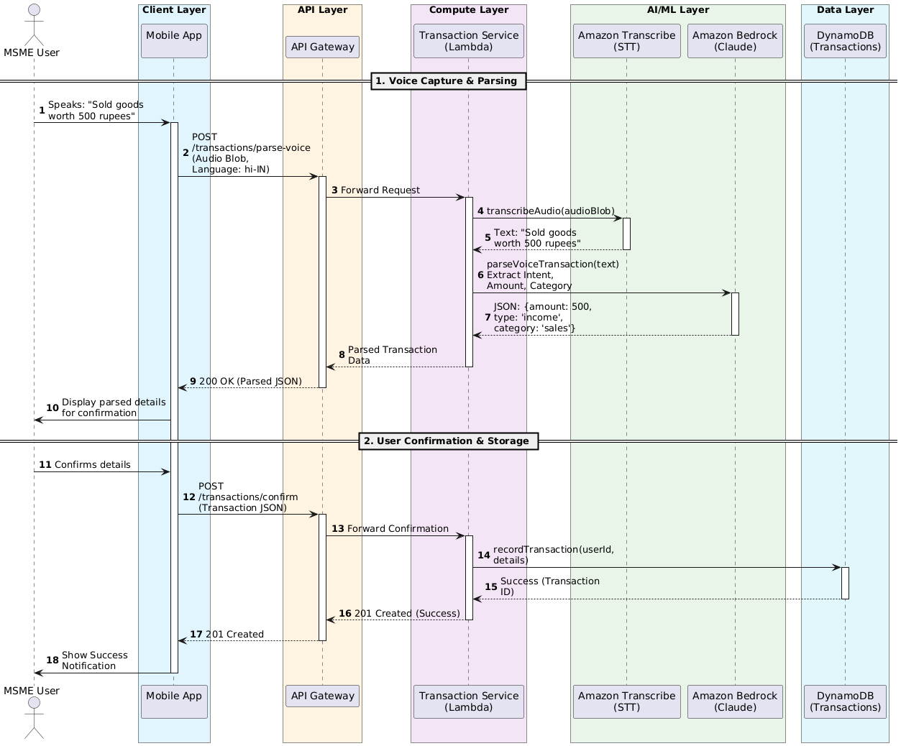

# Arthamitra - AI Finance Assistant for MSMEs

A mobile-first, AI-powered financial management platform designed for regional MSMEs in India, providing voice-based assistance in 8 regional languages.

## Key Features

### 🗣️ Voice-First Interface
- Multi-language voice interactions (Hindi, Tamil, Telugu, Marathi, Bengali, Gujarati, Kannada, Malayalam)
- Real-time speech-to-text transcription
- Natural language responses in your preferred language

### 💰 Smart Financial Tracking
- Voice-based transaction recording
- Daily profit/loss calculations
- Cash flow reporting and visualization
- Financial summaries (daily, weekly, monthly)

### 📄 Document Management
- Camera-based document capture with OCR
- Automatic field extraction (amounts, dates, invoice numbers, GST details)
- Smart document categorization (invoices, licenses, certificates, tax documents)
- Secure document sharing with expiring links

### 🎯 Government Scheme Matching
- Access to 200+ government loan and subsidy programs
- AI-powered eligibility analysis
- Pre-filled application forms
- Application tracking and deadline reminders

### 📊 GST Compliance
- Automated GST calculations and liability tracking
- GSTN-compatible report generation
- Filing reminders and deadline notifications
- Late fee calculations

### 🤖 AI Assistant
- Contextual answers to business queries
- Personalized guidance based on your data
- Human escalation when needed

## System Architecture

The platform runs on a serverless AWS infrastructure with:
- **API Layer**: AWS API Gateway + Cognito authentication
- **Application Layer**: AWS Lambda microservices
- **AI/ML Services**: Amazon Bedrock, Transcribe, Polly, Textract, Comprehend
- **Data Layer**: DynamoDB, S3, Timestream, OpenSearch
- **Mobile Client**: React PWA with offline-first capabilities

